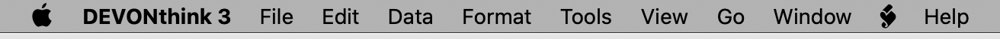

Tot grote tevredenheid gebruik ik [DEVONthink](https://www.devontechnologies.com/apps/devonthink) (DT) voor het bewaren van al mijn referentiemateriaal. De software biedt een heleboel extra scripts om diverse gegevens te importeren. Een daarvan is een import van je [Pinboard](https://pinboard.in/)bladwijzers. Dat script is lekker eenvoudig, maar er miste voor mij één ding. Ieder item krijgt als aanmaakdatum de datum waarop het aan DT werd toegevoegd. Daarmee is het lastig later eenvoudig te controleren wat al wel en niet werd geïmporteerd.

De oorspronkelijke aanmaakdatum is wel beschikbaar in [de API van Pinboard](https://pinboard.in/api). Dus heb ik de datum toegevoegd aan het script.

Download [het archiefbestand](Pinboard.scpt.zip) en pak het uit. Je vind dan het bestand `Pinboard.scpt`in je Downloads-map.

Kopieer het script naar de map `~/Library/Application Scripts/com.devon-technologies.think3/Menu/Import`. Je overschrijft dan het originele script dat met DT werd meegeleverd.

Je kunt de Scripts-map snel openen door vanuit de Finder in het menu te kiezen voor **Ga > Ga naar map…** en dan het hele pad daar te plakken. In plaats van de menukeuze kun je ook de sneltoets **⇧⌘G** gebruiken

Vanuit de applicatie DEVONthink kun je nu via het **Scripts-menu > Import > Pinboard** het script starten.

Succes met importeren.

Tip: Wil je al je bladwijzers opnieuw importeren met het script, verwijder dan eerst alle bestaande items. En leeg ook de prullenmand, omdat het script ook items overslaat die daar nog in zijn te vinden.