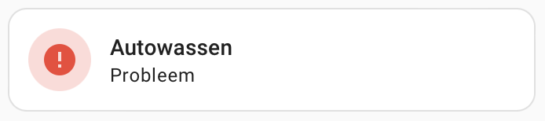

For some years I have been using the [Car Wash custom component for Home Assistant][repo] to have an indication if it is a good idea or not to wash the family car. It's fairly simple. You define a weather sensor to use and you're done.

What the car wash sensor actually does, is check for unfavorable current or forecasted weather conditions, precipitation and temperatures.

Recently, Home Assisant changed [how weather forecasts are retrieved][hablog] and deprecated some functionality.

As a thought experiment and to simplify my setup, I replace the car wash entity with a simple template binary sensor helper.

The template is this:

```yaml










{{ bad_condition or precipitation or freezing }}
```

Additionaly, I have set the device type of the sensor to "Problem", so it will show an appropriate icon.



[repo]: https://github.com/Limych/ha-car_wash/
[hablog]: https://www.home-assistant.io/blog/2023/09/06/release-20239/#weather-forecast-service